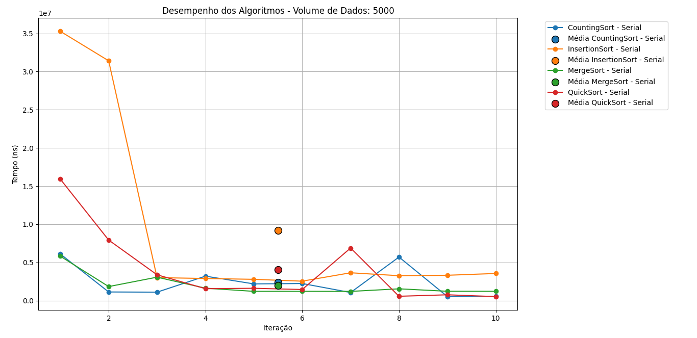
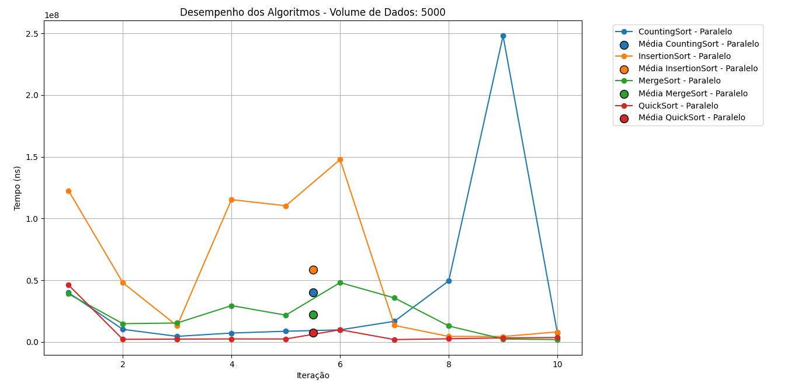
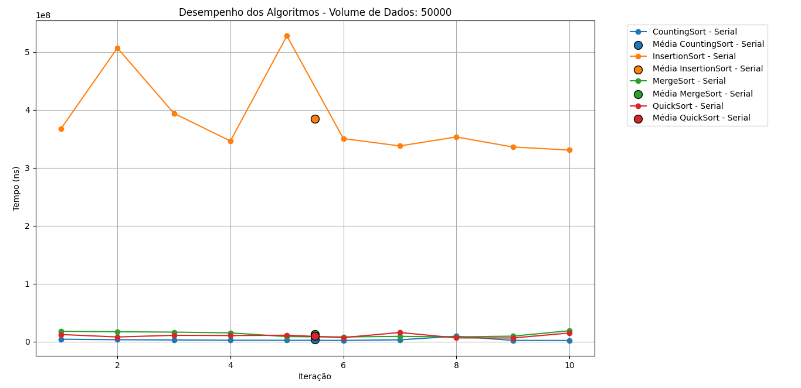
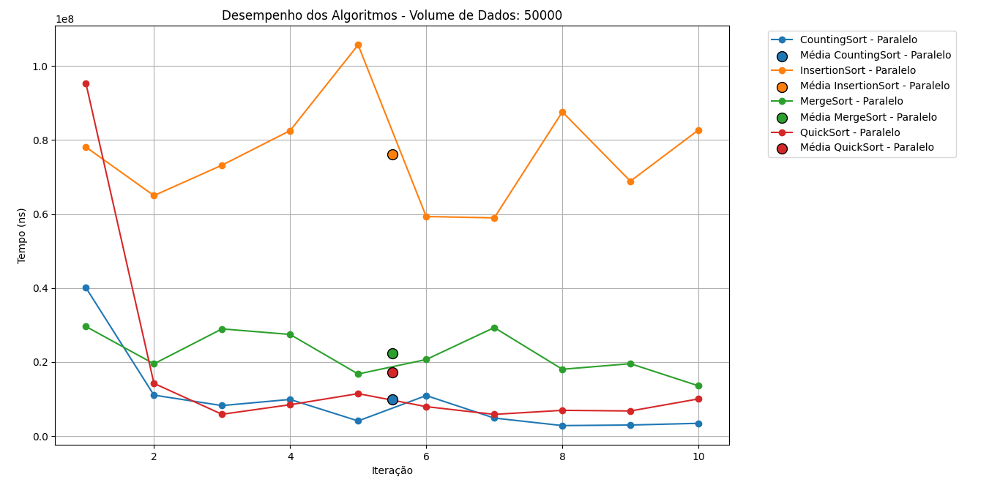
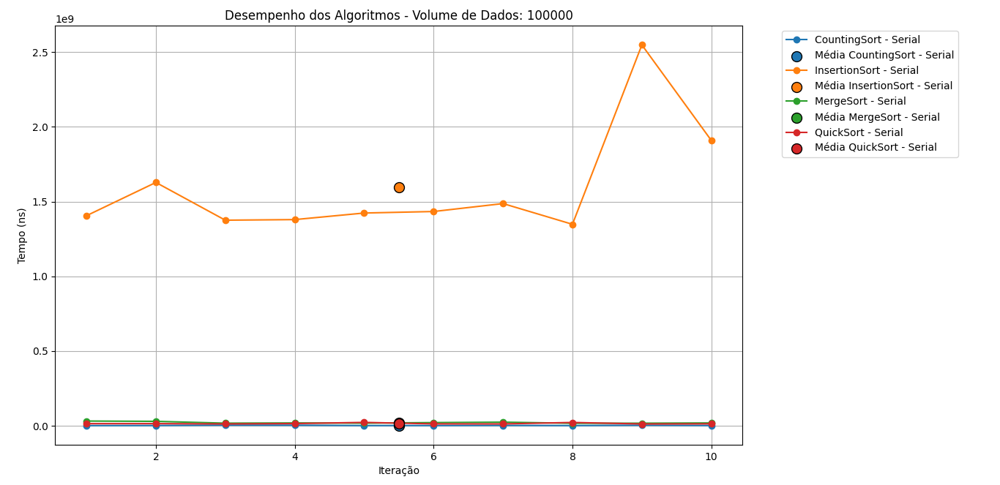
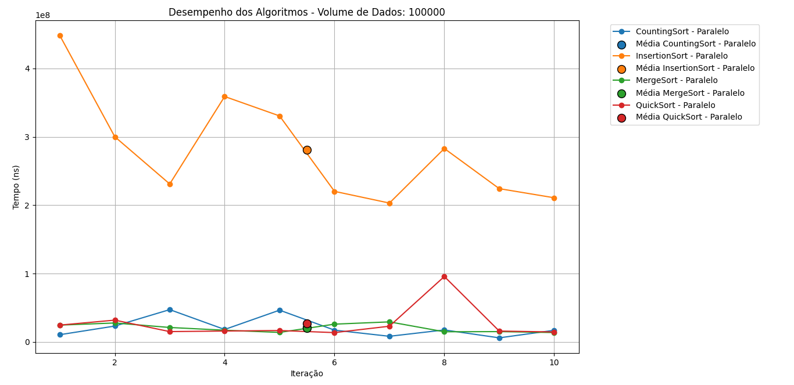
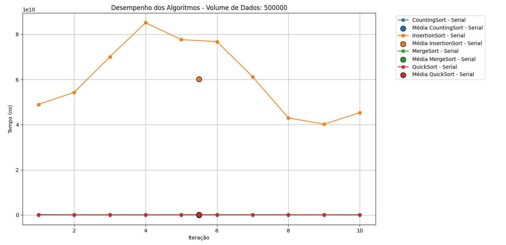
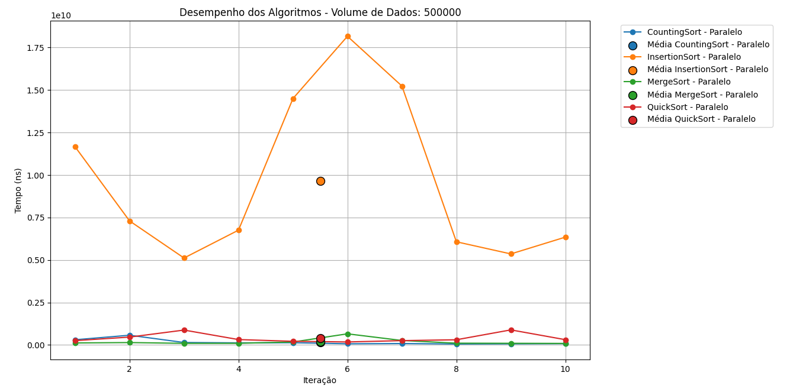
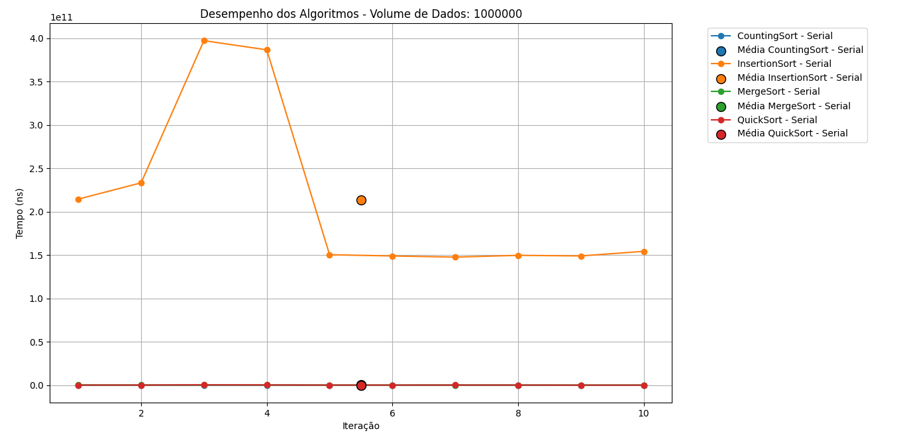
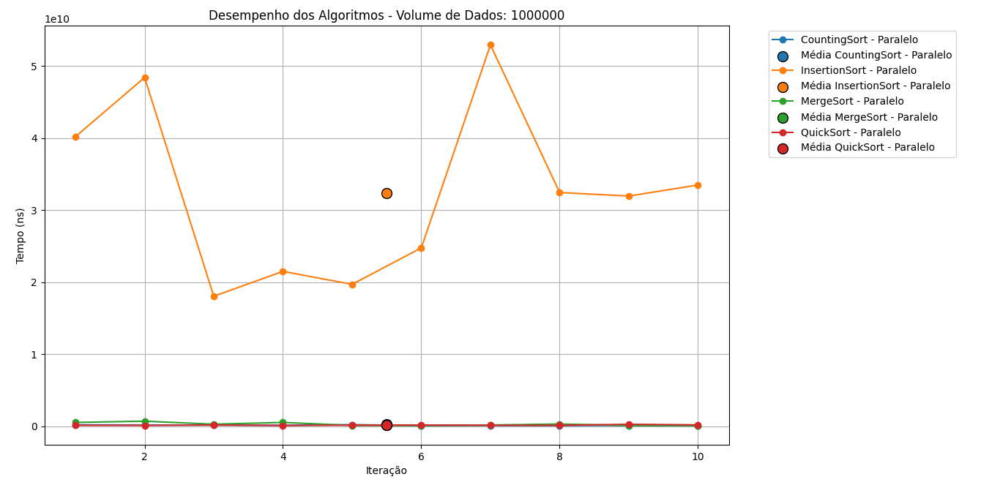

Integrantes: Samir Alves, Leonardo Coelho
link do github: https://github.com/AlvesAlbano/desempenho_algoritmos

# Resumo

Este estudo de caso analisa os impactos de threads na eficiência de quatro algoritmos de
ordenação. Foram implementadas versões sequências e paralelas desses algoritmos, utilizando
quatro threads para dividir e processar os subconjuntos de dados simultaneamente. Os
experimentos foram repetidos em dez iterações onde cada iteração os algoritmos usavam um
conjunto de dados, cujo elementos são únicos, de tamanho 5.000, 50.000, 100.000, 500.000 e
1.000.000 elementos, avaliando o tempo de execução de cada iteração. Os resultados mostram
que o paralelismo traz ganhos significativos em algoritmos recursivos de divisão e conquista,
enquanto em algoritmos comparativos e não-comparativos apresentam, respectivamente, ganho
razoável e nenhuma melhoria. Conclui-se que o uso de threads é vantajoso quando o custo de
criação e gerenciamento de threads é compensado pelo volume de dados.

# Introdução

O aumento da demanda por eficiência computacional tem impulsionado o uso de técnicas de
processamento paralelo. Com a popularização de processadores multicore, tornou-se possível
executar várias tarefas simultaneamente, reduzindo o tempo total de processamento. Neste
trabalho, analisamos o comportamento de quatro algoritmos de ordenação Insertion Sort, Quick
Sort, Merge Sort e Counting Sort em suas versões seriais e paralelas, implementadas na
linguagem Java. A abordagem visa compreender o impacto do uso de threads no desempenho
de cada algoritmo, considerando diferentes tamanhos de entrada e configurações de hardware.
O estudo também inclui a coleta dos tempos de execução de cada iteração, registrando os
resultados em arquivos CSV e permitindo a análise quantitativa dos dados. Além disso, esses
valores foram utilizados para a geração de gráficos comparativos, nos quais é possível visualizar
a variação do tempo ao longo das dez execuções para cada algoritmo e tamanho de entrada.
Dessa forma, torna-se possível realizar tanto uma comparação direta entre as versões
sequenciais e paralelas quanto uma interpretação visual do comportamento de desempenho em
diferentes cenários.

# Metodologia

A implementação dos algoritmos foi realizada na linguagem Java, na versão 24.0.2, explorando
as bibliotecas ForkJoinPool e ExecutorService para criação e gerenciamento automático de
threads. As versões paralelas dos algoritmos foram desenvolvidas com base nos conceitos de
multithreading, permitindo a execução simultânea de diferentes partes do código e o
aproveitamento eficiente de múltiplos núcleos de processamento. Para cada algoritmo, foi criada
uma versão sequencial, executada em um único fluxo de controle, e uma versão paralela, que
divide o conjunto de dados em subconjuntos processados de forma concorrente. O ambiente de
testes foi configurado para avaliar o desempenho dos algoritmos utilizando conjuntos de dados
fornecidos previamente em arquivos de texto, contendo diferentes volumes de elementos. Foram
realizadas dez execuções independentes para cada configuração, abrangendo tamanhos de
5.000, 50.000, 100.000, 500.000 e 1.000.000 elementos, a fim de garantir amostras consistentes
e reduzir o impacto de variações pontuais de desempenho. Durante os experimentos, foi medido
o tempo total de execução em nanossegundos para cada iteração. Esses valores foram salvos
tanto em arquivos CSV quanto utilizados para a geração de gráficos analíticos, produzidos em
Python, permitindo a visualização do comportamento do tempo de execução ao longo das dez
iterações. Foram gerados dois gráficos para cada tamanho de entrada: um exibindo os tempos
das versões sequenciais e outro para as versões paralelas. A partir da análise conjunta dos
valores médios e das curvas gráficas, foi possível comparar de forma mais precisa o desempenho
entre as versões sequenciais e paralelas de cada algoritmo, identificando quais se beneficiaram
mais do uso de múltiplas threads.

# Resultados e Discussão

Foram realizados testes de desempenho com os algoritmos Insertion Sort, Counting Sort, Merge
Sort e Quick Sort, em suas versões serial e paralela, utilizando vetores de 5.000, 50.000, 100.000,
500.000 e 1.000.000 elementos. Os resultados a seguir apresentam o tempo médio de execução
em nanossegundos obtido a partir de dez execuções independentes para cada configuração.

### Insertion Sort

| Tamanho do Vetor | Tempo Médio Serial (ns) | Tempo Médio Paralelo (ns) |
|------------------:|------------------------:|---------------------------:|
| 5.000            | 10.195.360,000          | 3.092.920,000              |
| 50.000           | 617.291.600,000         | 99.878.820,000             |
| 100.000          | 3.548.452.330,000       | 301.684.580,000            |
| 500.000          | 92.117.288.600,000      | 6.615.968.330,000          |
| 1.000.000        | 323.234.426.650,000     | 27.040.911.430,000         |

O Insertion Sort apresentou um comportamento visivelmente diferente entre as versões serial e
paralela. Devido à sua complexidade quadrática (O(n²)), a versão sequencial teve tempos de
execução extremamente altos à medida que o número de elementos aumentou. A versão paralela,
embora limitada pela natureza iterativa do algoritmo, demonstrou reduções expressivas no tempo
total, especialmente em vetores maiores chegando a ser cerca de 12 vezes mais mais rápida em
conjuntos com 1.000.000 elementos. Isso mostra que, mesmo em algoritmos tradicionalmente não
paralelizáveis, a divisão parcial de tarefas pode trazer ganhos relevantes em contextos de grande
volume de dados.

### Counting Sort

| Tamanho do Vetor | Tempo Médio Serial (ns) | Tempo Médio Paralelo (ns) |
|------------------:|------------------------:|---------------------------:|
| 5.000            | 1.788.430,000           | 2.570.150,000              |
| 50.000           | 6.749.150,000           | 15.739.700,000             |
| 100.000          | 12.510.280,000          | 16.300.180,000             |
| 500.000          | 33.054.150,000          | 41.414.730,000             |
| 1.000.000        | 83.019.970,000          | 113.387.920,000            |

O Counting Sort teve desempenho superior em sua forma serial, com tempos muito baixos mesmo
em vetores grandes. Por possuir complexidade O(n + k) e ser dominado por operações
sequenciais de contagem, o algoritmo não se beneficia significativamente da paralelização. A
versão paralela apresentou desempenho inferior em todos os cenários, uma vez que o custo de
criar threads e sincronizar contadores superou o ganho potencial de execução simultânea. Assim,
o Counting Sort se mostra mais eficiente em sua forma tradicional para os tamanhos testados.

### Merge Sort

| Tamanho do Vetor | Tempo Médio Serial (ns) | Tempo Médio Paralelo (ns) |
|------------------:|------------------------:|---------------------------:|
| 5.000            | 2.178.250,000           | 1.281.540,000              |
| 50.000           | 13.625.690,000          | 14.670.100,000             |
| 100.000          | 25.722.230,000          | 23.305.960,000             |
| 500.000          | 155.644.250,000         | 99.682.940,000             |
| 1.000.000        | 289.443.130,000         | 168.803.690,000            |

O Merge Sort, que naturalmente segue o paradigma dividir para conquistar, apresentou ganhos
consistentes com a paralelização, especialmente em conjuntos maiores. Enquanto as pequenas
entradas mostraram tempos próximos entre as duas versões, para 500.000 e 1.000.000 de
elementos houve redução de aproximadamente 35% a 40% no tempo médio. Esse
comportamento reforça que o Merge Sort é altamente adequado à execução paralela, pois suas
etapas de divisão e mesclagem podem ser distribuídas eficientemente entre as threads.

### Quick Sort

| Tamanho do Vetor | Tempo Médio Serial (ns) | Tempo Médio Paralelo (ns) |
|------------------:|------------------------:|---------------------------:|
| 5.000            | 3.662.430,000           | 934.980,000                |
| 50.000           | 9.783.760,000           | 10.917.760,000             |
| 100.000          | 18.104.530,000          | 16.798.380,000             |
| 500.000          | 108.178.420,000         | 85.113.140,000             |
| 1.000.000        | 203.487.440,000         | 105.429.460,000            |

O Quick Sort, em vetores menores, o custo de criação e sincronização de threads fez com que a
versão paralela não superasse a serial. Contudo, a partir de 100.000 elementos, a paralelização
começou a mostrar ganhos expressivos, reduzindo o tempo médio quase pela metade em vetores
com 1.000.000 de elementos. Como o algoritmo se baseia em partições recursivas
independentes, sua escalabilidade paralela é naturalmente elevada, tornando-o um dos mais
beneficiados pelo uso de múltiplos núcleos.

# Análise Gráfica dos Tempos de Execução

Nesta subseção são apresentados os gráficos referentes ao tempo de execução do algoritmo
para cada tamanho de amostra utilizado. A análise gráfica possibilita observar a relação entre o
aumento do tamanho da entrada e a variação no tempo de execução, permitindo verificar se o
comportamento experimental aproxima-se da complexidade teórica esperada para o algoritmo
analisado.

### Tamanho da Amostra: 5.000 elementos

### Tamanho da Amostra: 50.000 elementos

### Tamanho da Amostra: 100.000 elementos

### Tamanho da Amostra: 500.000 elementos

### Tamanho da Amostra: 1.000.000 elementos

# Conclusão

Este trabalho nos permitiu analisar o impacto da paralelização na eficiência de diferentes
algoritmos de ordenação. A comparação entre as versões sequenciais e paralelas de Insertion
Sort, Counting Sort, Merge Sort e Quick Sort mostrou que a estrutura de cada algoritmo influencia
diretamente seu ganho de desempenho. Algoritmos recursivos baseados em dividir para
conquistar, como Merge Sort e Quick Sort, apresentaram as melhores melhorias, especialmente
para grandes volumes de dados. Já o Insertion Sort mostrou ganhos limitados, enquanto o
Counting Sort não se beneficiou da paralelização, chegando inclusive a registrar aumento no
tempo devido ao custo de gerenciamento de threads. Essas observações reforçam que a
paralelização nem sempre garante ganhos de desempenho, dependendo da tarefa, da
quantidade de dados e da sobrecarga de gerenciamento das threads. Contudo, em cenários
adequados, o uso de múltiplos núcleos se mostrou altamente benéfico, reduzindo
significativamente o tempo total de processamento e melhorando a eficiência geral do sistema.
De forma geral, conclui-se que o processamento paralelo em Java, quando aplicado a algoritmos
compatíveis com esse paradigma, é uma estratégia eficiente para otimizar aplicações que lidam
com grandes quantidades de dados.

# Referências
ORACLE. Class ForkJoinPool (Java Platform SE 24). Disponível em:
https://docs.oracle.com/en/java/javase/24/docs/api/java.base/java/util/concurrent/ForkJoinPool.ht
ml. Acesso em: 20 out. 2025.

ORACLE. Interface ExecutorService (Java Platform SE 24). Disponível em:
https://docs.oracle.com/en/java/javase/24/docs/api/java.base/java/util/concurrent/ExecutorServic
e.html. Acesso em: 20 out. 2025.